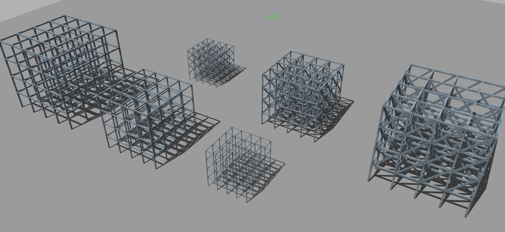
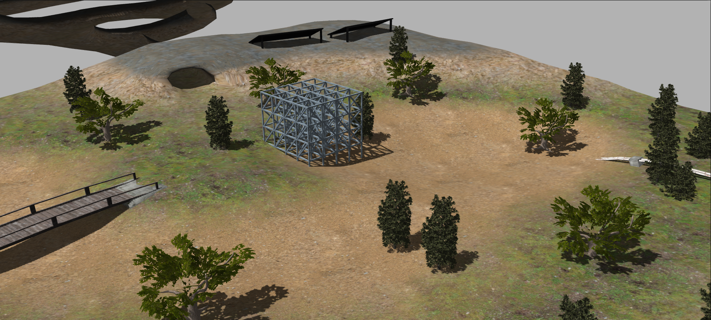
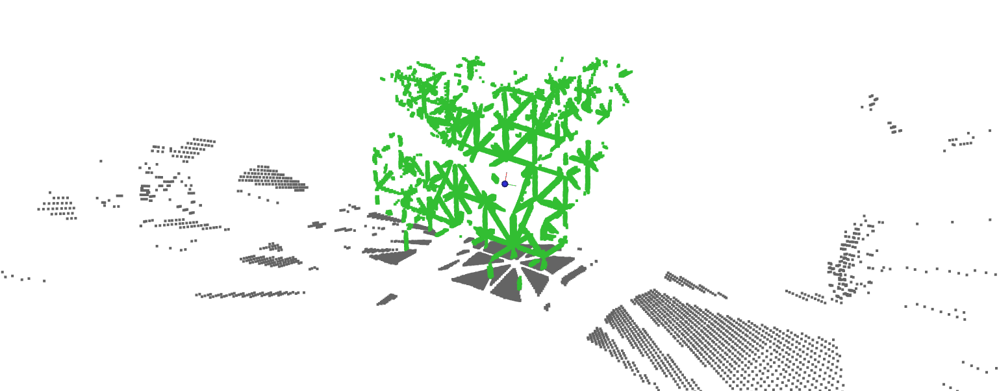

# A proposed method for segmenting reticular structures using 3D LiDAR information.

Description
-----------
This repository contains the implementation of an algorithm to segment reticular structres in outdoor environments from a 3D LiDAR sensor. Additionally contains several datasets of point clouds to evaluate its performance.

Its implementation has been carried out using the PCL (Point Cloud Library) library in C++ language.

* [PCL: Point Cloud Library](http://pointclouds.org/)

Example Datasets
----------------
Datasets are distruted usign PCL format (.pcd). The point clouds are of type pcl::PointXYZL. The datasets are labelled, using greater label values than 0 for the structure and 0 for the environment.

| **Set ID**      | **Type**      | **Bar Length**  | **Width**      | **Link**       |
|-----------------|---------------|-----------------|----------------|----------------|
| 00              | Orthogonal    | 2.0 m           | 0.15 m         |[Set 00](https://drive.google.com/file/d/1FYVF96RYD9Yk5SKCpc8dwjqNruJ3uLR5/view?usp=drive_link)      |
| 01              | Orthogonal    | 1.5 m           | 0.10 m         |[Set 01](https://drive.google.com/file/d/1EZ69wrOLOCmgP-sgg-6LzNJkljkS_Z62/view?usp=drive_link)      |
| 02              | Orthogonal    | 1.0 m           | 0.05 m         |[Set 02](https://drive.google.com/file/d/1xU5krXs_TbyZnnk6jSc2HPjnH5iq4i8Z/view?usp=drive_link)      |
| 03              | Crossed       | 2.0 m           | 0.15 m         |[Set 03](https://drive.google.com/file/d/1sXsGT8T3GWq9OOeNuL-M_Fk-M-aT5-y2/view?usp=drive_link)      |
| 04              | Crossed       | 1.5 m           | 0.10 m         |[Set 04](https://drive.google.com/file/d/1zFoetahNHks-C-OJAxY3jmId5JYX3z5w/view?usp=drive_link)      |
| 05              | Crossed       | 1.0 m           | 0.05 m         |[Set 05](https://drive.google.com/file/d/1l0t9yjl85nfXQiTDbqmHXccQToqGGQT8/view?usp=drive_link)      |
